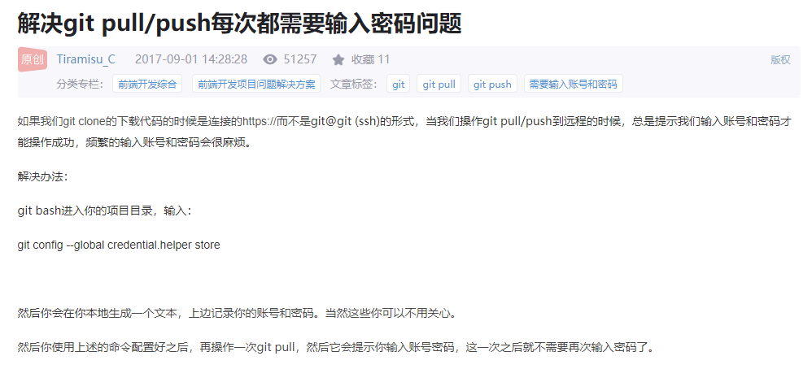
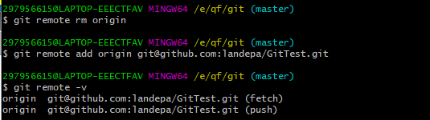
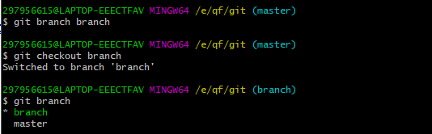
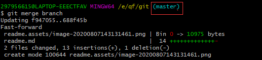

# Git使用教程

## SVN与Git

## Git图解

Git区域主要分为：工作区——暂存区——本地仓库

## 基本流程

1. github注册，登录
2. git下载，安装
3. 在github创建远程仓库
4. git指令在本地初始化

git config --global credential.helper store

## 本地操作指令

### **git init**	

把当前目录初始化为一个版本库

### **git add .**	

提交所有新文件(new)和被修改(modified)文件，不包括被删除(deleted)文件，没有任何提示时，说明提交成功

### **git  status**

查看当前工作目录和暂缓区状态

### **git commit -m 'remarks'**

将暂存区的文件提交到本地仓库

### git log / git reflog

**git log：**查看操作日志（详细版）

**git reflog：**查看操作日志（简易版）

### git diff readme.md

查看工作区修改的内容，查看文件变更的信息

### git reset --hard HEAD^

回退到上一版本

**git reset --hard HEAD^^：**回退两个版本

**git reset --hard 2e248b2：**回退到指定版本

### rm readme.md

删除readme文件

## q / #wq

退出编辑模式

## 远程仓库操作

### git remote add

**git remote add origin https://github.com/landepa/GitTest.git**
关联远程仓库，无提示说明连接成功

**origin代指远程仓库名称**

### git remote -v

查看关联的远程仓库地址

**fetch：**拉取

**push：**推送

### git remove rm origin

删除连接的远程仓库地址，名为origin

**更换地址需先删除再添加**

### git push

本地仓库提交到远程仓库

**git push -u origin master**

==第一次需设置默认仓库及分支==

**git push**

之后可以直接push
## git pull

拉取远程仓库的代码到本地

==先提交本地仓库代码再拉取==

## git clone

**git clone https://github.com/landepa/GitTest.git**

克隆项目，默认绑定远程仓库地址，可以 log 看到日志

## 分支操作

### git branch branch1

创建分支，分支名为：branch

### git checkout branch1

切换到branch1分支

### git branch

查看所有分支

### git branch -d branch1

删除分支名为branch1的分支

### git merge branch1

在主干上合并分支名为branch1的分支

==分支上的内容提交到本地后，需切换到主分支（master）后，再合并分支（分支名为：branch1）==

### git push origin branch

将分支内容推送到远程仓库的分支中

## SSHKey

### cd ~/.ssh

查询是否有ssh密钥

